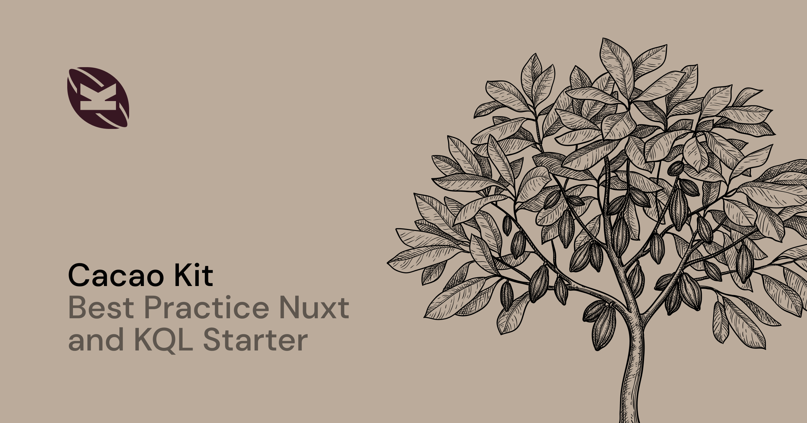

[](https://cacao-kit.byjohann.dev)

# Cacao Kit (Frontend)

> **Note**
>
> If this is your first time building an application with Nuxt, I recommend taking a look into the [💚 Kirby Nuxt Starterkit](https://github.com/johannschopplich/kirby-nuxt-starterkit) first to get a basic understanding of this tech-stack. It is a port of the Kirby starter kit, built with Nuxt and KQL.

This repository provides a minimal but feature-rich Nuxt 3 starter kit. It fetches content from the [🍫 Cacao Kit backend](https://github.com/johannschopplich/cacao-kit-backend), a headless Kirby instance. It is the evolved version of the [Kirby Nuxt Starterkit](https://github.com/johannschopplich/kirby-nuxt-starterkit) and my best practice solution to build a Nuxt based frontend on top of Kirby CMS.

You can harness every feature Nuxt provides to build a server-side rendered application or even pre-render the content using [Nuxt's static generation](https://nuxt.com/docs/getting-started/deployment#static-hosting).

Key design decisions is a block-first approach. Meaning, you can use Kirby's page structure as the source of truth and don't have to replicate the page structure in Nuxt. All pages are rendered by the [catch-all route](./pages/[...id].vue). Of course, you don't have to stick with the block-first architecture.
If it doesn't speak to you or if you need custom Kirby page blueprints with custom fields, you can always create Nuxt pages and query the content using KQL. See the [`pages/about.vue`](./pages/about.vue) page for an example.

## Key Features

- 🌐 Internationalization with [`@leanera/nuxt-i18n`](https://github.com/leanera/nuxt-i18n)
- 🏆 Motto: [“Everything is a block”](./components/Kirby/Block/) – Kirby blocks define what to render for each page
- 🛣️ All pages are rendered by the [catch-all route](./pages/[...id].vue) by default (you can still create Nuxt pages)
- 🌌 Use Kirby's page structure as the source of truth
- 🫂 Kirby Query Language with [`nuxt-kql`](https://nuxt-kql.byjohann.dev)
- 🏛 Global [site data](./plugins/site.ts) similar to Kirby's `$site`
- 🔎 SSR generated SEO data
- 📐 Prettier & ESLint
- 🔢 Pre-configured [VSCode settings](./.vscode/settings.json)

## Usage

### Prerequisites

1. Enable [Corepack](https://github.com/nodejs/corepack) using `corepack enable`
2. Install dependencies using `pnpm install`
3. Adapt the relevant environment variables:

```bash
# Base URL of the Kirby backend
KIRBY_BASE_URL=
# Token for bearer authentication
# See https://github.com/johannschopplich/cacao-kit-backend#bearer-token
KIRBY_API_TOKEN=
```

### Development

1. Start the development server using `pnpm run dev`
2. Visit [localhost:3000](http://localhost:3000/)

> ℹ️ Enable [Take Over Mode](https://vuejs.org/guide/typescript/overview.html#volar-takeover-mode) in Visual Studio Code.

### Production

Build the application for production with `pnpm run build`.

Check out the [deployment documentation](https://nuxt.com/docs/getting-started/deployment).

## Cookbook

### Static Hosting

You can use Nuxt's [static generation](https://nuxt.com/docs/getting-started/deployment#static-hosting) to pre-render the content. This is especially useful if you want to host the application on a CDN or a static hosting service like [Netlify](https://www.netlify.com).

### How to Add a New Block

Given you have created the block in the Kirby backend, you can add it to the frontend by following these steps:

- Create a new component in the [`components/Kirby/Block/`](./components/Kirby/Block/) directory.
- Add the new block to the [`components/Kirby/Blocks.vue`](./components/Kirby/Blocks.vue) component to make it available when rendering the block's field JSON data.

For example, let's say you have created a new block called `NoteHeader` and want to render it with the `KirbyBlocks` component:

```diff
<script setup lang="ts">
import {
+  LazyKirbyBlockNoteHeader,
} from '#components'

const blockComponents: Partial<Record<string, new () => ComponentPublicInstance>> = {
  // Custom blocks
+  'note-header': LazyKirbyBlockNoteHeader,
}
</script>
```

### How to Bring Your Own Styling

This kit is written in semantic HTML and styled by the class-less CSS framework [new.css](https://newcss.net/). It is only used for the demo content. You can remove the framework by deleting the `<Link />` tag in the [`app.vue`](./app.vue) component and start over with your own styling.

### Deployment

Just like any other Nuxt application, the Cacao Kit can be deployed on a Node.js server, pre-rendered for static hosting, or deployed to serverless or edge (CDN) environments. Follow the [deployment documentation](https://nuxt.com/docs/getting-started/deployment) to learn more.

This repository includes a [`netlify.toml`](./netlify.toml) file to deploy the application to [Netlify](https://www.netlify.com) and a [`wrangler.toml`](./wrangler.toml) file to deploy the application to [Cloudflare Workers](https://workers.cloudflare.com).

#### Deployment Previews

- Netlify 👉 [cacao-kit.netlify.app](https://cacao-kit.netlify.app)
- Cloudflare Workers 👉 [cacao-kit.byjohann.dev](https://cacao-kit.byjohann.dev)

## What's Kirby?

- **[getkirby.com](https://getkirby.com)** – Get to know the CMS.
- **[Try it](https://getkirby.com/try)** – Take a test ride with our online demo. Or download one of our kits to get started.
- **[Documentation](https://getkirby.com/docs/guide)** – Read the official guide, reference and cookbook recipes.
- **[Issues](https://github.com/getkirby/kirby/issues)** – Report bugs and other problems.
- **[Feedback](https://feedback.getkirby.com)** – You have an idea for Kirby? Share it.
- **[Forum](https://forum.getkirby.com)** – Whenever you get stuck, don't hesitate to reach out for questions and support.
- **[Discord](https://chat.getkirby.com)** – Hang out and meet the community.
- **[YouTube](https://youtube.com/kirbyCasts)** - Watch the latest video tutorials visually with Bastian.
- **[Twitter](https://twitter.com/getkirby)** – Spread the word.
- **[Instagram](https://www.instagram.com/getkirby/)** – Share your creations: #madewithkirby.

## License

[MIT](./LICENSE) License © 2023-present [Johann Schopplich](https://github.com/johannschopplich)
