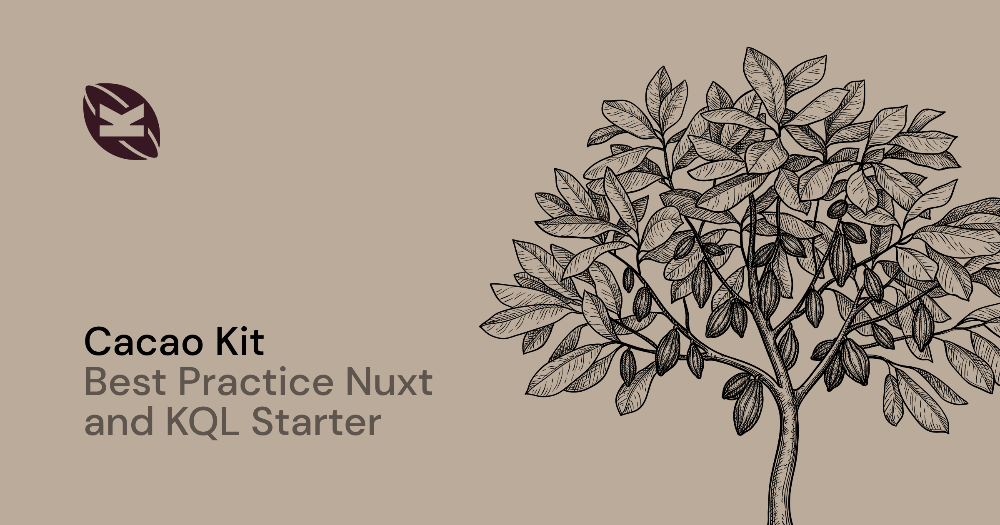

<div align="center">

[](https://cacao-kit.byjohann.dev)

# Cacao Kit (Frontend)

A production-ready Nuxt starter kit for headless Kirby CMS.

[Usage](#usage) •
[Architecture](#architecture--development) •
[Deployment](#deployment)

</div>

> [!TIP]
> If internationalization is **not** a requirement for your project, check out the [🧱 branch without Nuxt i18n](https://github.com/johannschopplich/cacao-kit-frontend/compare/main...chore/without-i18n).
>
> If this is your first time building an application with Nuxt and Kirby, take a look at the [💚 Kirby Nuxt Starterkit](https://github.com/johannschopplich/kirby-nuxt-starterkit) first to get a basic understanding of this tech stack.

This is a minimal but feature-rich Nuxt starter kit and the evolved version of the [Kirby Nuxt Starterkit](https://github.com/johannschopplich/kirby-nuxt-starterkit). It pairs with the [🍫 Cacao Kit backend](https://github.com/johannschopplich/cacao-kit-backend).

## Key Features

- 🏆 Motto: ["Everything is a block"](./components/Kirby/Block/) – Kirby blocks define what to render for each page
- 🛣️ All pages are rendered by the [catch-all route](./pages/[...slug].vue) by default (you can still create Nuxt pages)
- 🌌 Use Kirby's page structure as the source of truth
- 🫂 Kirby Query Language with [`nuxt-kirby`](https://nuxt-kirby.byjohann.dev)
- 🌐 Internationalization with [`@nuxtjs/i18n`](https://github.com/nuxt-modules/i18n)
- 🏛 Global [site data](./plugins/site.ts) similar to Kirby's `$site`
- 🔎 SSR-generated SEO data
- 📐 Prettier & ESLint
- 🔢 Pre-configured [VSCode settings](./.vscode/settings.json)

The block-first approach is a core design decision: use Kirby's page structure as the source of truth without replicating it in Nuxt. All pages are rendered by the [catch-all route](./pages/[...slug].vue).

If you need custom Kirby page blueprints with custom fields, you can create dedicated Nuxt pages and query the content using KQL. See [`pages/about.vue`](./pages/about.vue) for an example.

## Usage

### Prerequisites

1. Enable [Corepack](https://github.com/nodejs/corepack) using `corepack enable`
2. Install dependencies using `pnpm install`
3. Adapt the relevant environment variables:

```bash
# Base URL of the Kirby backend
KIRBY_BASE_URL=
# Token for bearer authentication
# See https://github.com/johannschopplich/cacao-kit-backend#bearer-token
KIRBY_API_TOKEN=
```

### Development

1. Start the development server using `pnpm run dev`
2. Visit [localhost:3000](http://localhost:3000/)

### Production

Build the application for production with `pnpm run build`.

Check out the [deployment documentation](https://nuxt.com/docs/getting-started/deployment).

## Architecture & Development

### Project Structure

The Cacao Kit follows a clear architectural pattern designed around its block-first approach:

```
app/
├── components/
│   └── Kirby/
│       ├── Block/           # Individual block components
│       ├── Blocks.vue       # Block renderer
│       └── Layouts.vue      # Layout renderer
├── composables/
│   ├── links.ts             # Internal link handling
│   └── proxy.ts             # Development proxy utilities
├── pages/
│   ├── [...slug].vue        # Universal page renderer
│   └── about.vue            # Custom page example
├── plugins/
│   └── site.ts              # Global site data management
└── queries/                 # KQL query definitions
    ├── index.ts
    ├── page.ts
    ├── site.ts
    └── prefetch.ts
```

### Block-First Architecture

Every page is rendered through the catch-all route `[...slug].vue`, which dynamically renders either:

- **Layouts**: Column-based content using `KirbyLayouts`
- **Blocks**: Linear content using `KirbyBlocks`

```vue
<template>
  <div>
    <KirbyLayouts v-if="page?.layouts?.length" :layouts="page.layouts" />
    <KirbyBlocks v-else-if="page?.blocks" :blocks="page.blocks" />
  </div>
</template>
```

### Adding New Blocks

1. **Create the block component** in `app/components/Kirby/Block/`:

```vue
<!-- app/components/Kirby/Block/MyCustomBlock.vue -->
<script setup lang="ts">
import type { KirbyBlock } from '#nuxt-kirby'

defineProps<{
  block: KirbyBlock<'my-custom-block'>
}>()
</script>

<template>
  <section class="my-custom-block">
    <h2>{{ block.content.title }}</h2>
    <div v-html="block.content.text" />
  </section>
</template>
```

2. **Register the block** in `app/components/Kirby/Blocks.vue`:

```ts
import { LazyKirbyBlockMyCustomBlock } from '#components'

const blockComponents: Record<string, Component> = {
  // Custom blocks
  'my-custom-block': LazyKirbyBlockMyCustomBlock,
}
```

### Working with KQL Queries

Define reusable queries in the `queries/` directory:

```ts
// app/queries/blog.ts
import type { KirbyQuerySchema } from 'kirby-types'

export const blogQuery: KirbyQuerySchema = {
  query: 'page("blog")',
  select: {
    title: true,
    children: {
      query: 'page.children.listed',
      select: {
        title: true,
        date: true,
        excerpt: 'page.text.excerpt(300)',
        cover: {
          query: 'page.cover.toFile?.resize(600)',
          select: ['url', 'alt'],
        },
      },
    },
  },
}
```

Use them in components:

```vue
<script setup lang="ts">
import { blogQuery } from '~/queries/blog'

const { locale } = useI18n()
const { data } = await useKql(blogQuery, {
  language: locale.value,
})
</script>
```

### Internationalization

The kit includes full i18n support with [`@nuxtjs/i18n`](https://i18n.nuxtjs.org).

### Custom Styling

This kit uses semantic HTML with minimal styling via [new.css](https://newcss.net) for demonstration. To implement your own styling, remove the import in `app.vue` and add your custom styles.

## Deployment

### Static Site Generation

For maximum performance and CDN compatibility, generate a static site:

```bash
pnpm run generate
```

This creates a fully static version in the `dist/` directory that can be hosted on any static hosting service.

### Server-Side Rendering

Deploy with full SSR capabilities:

```bash
pnpm run build
```

### Environment Configuration

Ensure these environment variables are set in production:

```bash
# Required: Your Kirby backend URL
KIRBY_BASE_URL=https://your-kirby-backend.com

# Required: Authentication token for KQL queries
KIRBY_API_TOKEN=your-secret-token

# Optional: Public site URL for SEO and social sharing
NUXT_PUBLIC_SITE_URL=https://your-frontend.com
```

### Preview

- Production site: [cacao-kit.byjohann.dev](https://cacao-kit.byjohann.dev)

<details>
<summary>What's Kirby?</summary>

- **[getkirby.com](https://getkirby.com)** – Get to know the CMS.
- **[Try it](https://getkirby.com/try)** – Take a test ride with our online demo. Or download one of our kits to get started.
- **[Documentation](https://getkirby.com/docs/guide)** – Read the official guide, reference and cookbook recipes.
- **[Issues](https://github.com/getkirby/kirby/issues)** – Report bugs and other problems.
- **[Feedback](https://feedback.getkirby.com)** – You have an idea for Kirby? Share it.
- **[Forum](https://forum.getkirby.com)** – Whenever you get stuck, don't hesitate to reach out for questions and support.
- **[Discord](https://chat.getkirby.com)** – Hang out and meet the community.
- **[YouTube](https://youtube.com/kirbyCasts)** – Watch the latest video tutorials with Bastian.
- **[Mastodon](https://mastodon.social/@getkirby)** – Spread the word.
- **[Instagram](https://www.instagram.com/getkirby/)** – Share your creations: #madewithkirby.

</details>

## License

[MIT](./LICENSE) License © 2023-PRESENT [Johann Schopplich](https://github.com/johannschopplich)
